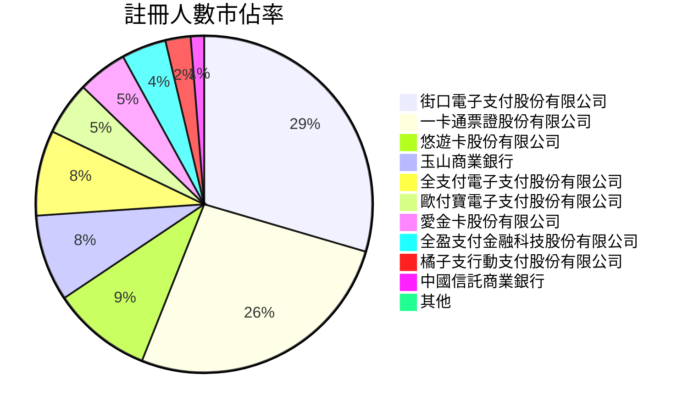
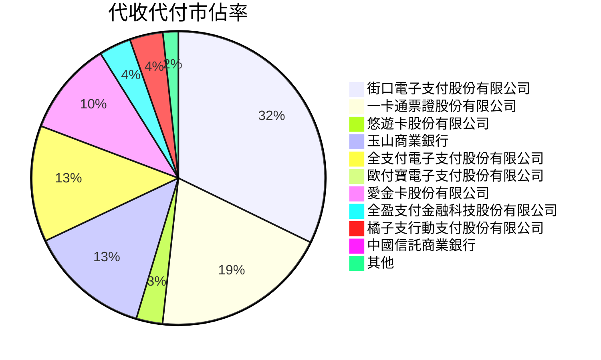
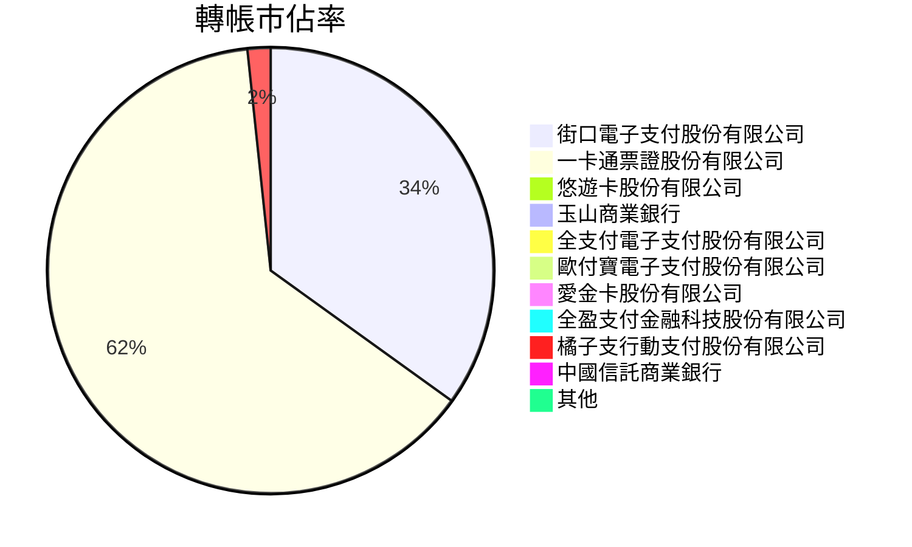
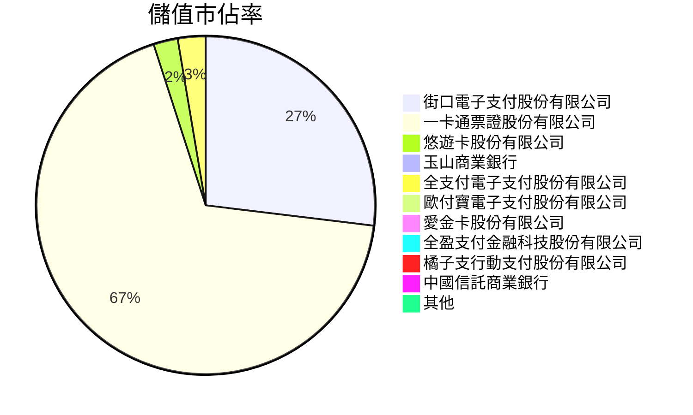
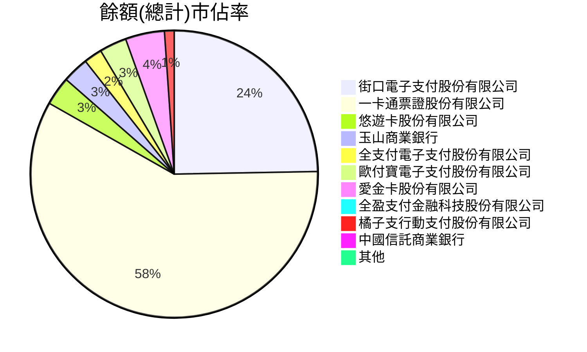
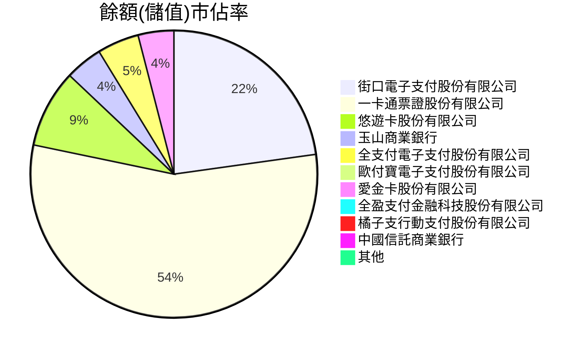
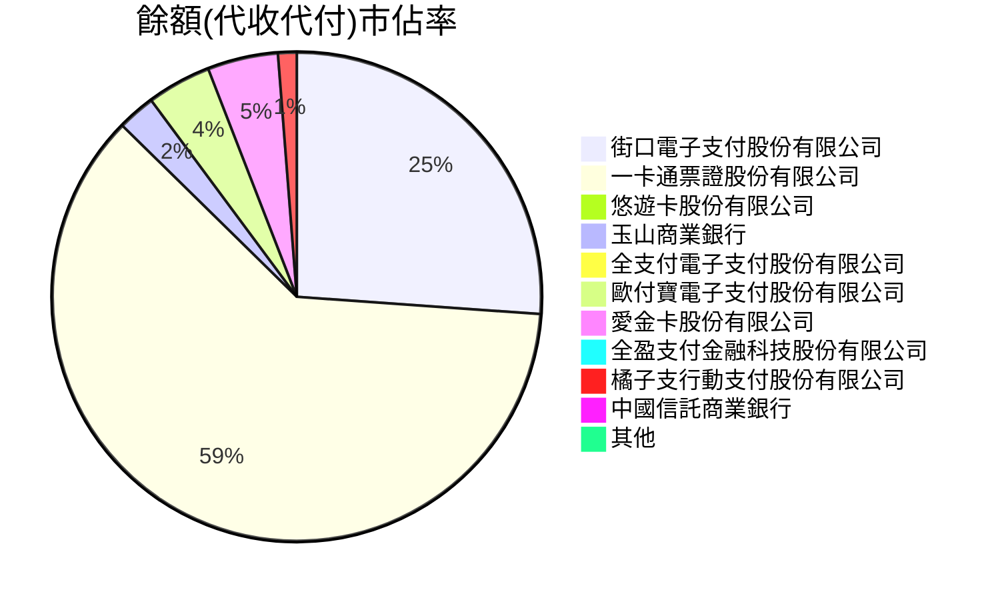

# 11109

| 機構代碼 | 機構名稱                     | 註冊人數 | 代收代付 |    轉帳 |     儲值 |    餘額 | 儲值餘額 | 代收代付餘額 | 餘額-(儲值餘額+代收代付餘額) |
| -------- | ---------------------------- | -------: | -------: | ------: | -------: | ------: | -------: | -----------: | ---------------------------: |
| 396      | 街口電子支付股份有限公司     |  5845643 |  3402007 | 3930550 |  6438042 | 2167958 |   578851 |      1589106 |                            1 |
| 391      | 一卡通票證股份有限公司       |  5241674 |  2060529 | 7133911 | 16281209 | 5132456 |  1408507 |      3723949 |                            0 |
| 390      | 悠遊卡股份有限公司           |  1896105 |   306225 |   78401 |   554107 |  283594 |   222905 |        60689 |                            0 |
| 808      | 玉山商業銀行                 |  1644974 |  1408994 |       0 |    27384 |  259023 |   107001 |       152022 |                            0 |
| 389      | 全支付電子支付股份有限公司   |  1619709 |  1351952 |    4613 |   633949 |  179904 |   119602 |        60302 |                            0 |
| 397      | 歐付寶電子支付股份有限公司   |  1013727 |    50984 |    9705 |     4351 |  268812 |    10252 |       258560 |                            0 |
| 392      | 愛金卡股份有限公司           |   943018 |  1092919 |   68361 |   218812 |  386007 |   102327 |       283679 |                            1 |
| 388      | 全盈支付金融科技股份有限公司 |   850157 |   372802 |     777 |    47794 |   65191 |    23346 |        41846 |                           -1 |
| 395      | 橘子支行動支付股份有限公司   |   479061 |   385580 |  188045 |    43068 |   95611 |    20497 |        75114 |                            0 |
| 822      | 中國信託商業銀行             |   255334 |    21623 |       0 |        0 |   30943 |      602 |        30341 |                            0 |
| 398      | 簡單行動支付股份有限公司     |    62648 |     4037 |    2603 |      512 |    5986 |     1180 |         4806 |                            0 |
| 394      | 國際連股份有限公司           |    35258 |        0 |     149 |      113 |     969 |      551 |          418 |                            0 |
| 700      | 中華郵政公司                 |    25080 |    63794 |       0 |        0 |       0 |        0 |            0 |                            0 |
| 812      | 台新國際商業銀行             |    14963 |    15874 |       0 |        0 |     197 |        0 |          197 |                            0 |
| 009      | 彰化商業銀行                 |     8668 |    10698 |       0 |        0 |     349 |        0 |          349 |                            0 |
| 006      | 合作金庫商業銀行             |     8394 |    28609 |       0 |        0 |       0 |        0 |            0 |                            0 |
| 108      | 陽信商業銀行                 |     6590 |      337 |       0 |        0 |       0 |        0 |            0 |                            0 |
| 004      | 臺灣銀行                     |     5585 |    10275 |       0 |        0 |       0 |        0 |            0 |                            0 |
| 005      | 臺灣土地銀行                 |     4577 |     6867 |       0 |        0 |       0 |        0 |            0 |                            0 |
| 807      | 永豐商業銀行                 |     3719 |     5082 |       0 |        0 |     164 |        0 |          164 |                            0 |
| 050      | 臺灣中小企業銀行             |     2467 |     3574 |       0 |        0 |     293 |        0 |          293 |                            0 |
| 806      | 元大商業銀行                 |     2099 |     7262 |       0 |        0 |     187 |        0 |          187 |                            0 |
| 011      | 上海商業儲蓄銀行             |     1715 |     1762 |       0 |        0 |       0 |        0 |            0 |                            0 |
| 012      | 台北富邦商業銀行             |     1570 |      752 |       0 |        0 |      86 |        0 |           86 |                            0 |
| 007      | 第一商業銀行                 |     1504 |     1959 |       0 |        0 |     110 |        0 |          110 |                            0 |
| 008      | 華南商業銀行                 |     1058 |      960 |       0 |        0 |      42 |        0 |           42 |                            0 |
| 017      | 兆豐國際商業銀行             |      814 |      583 |       0 |        0 |      31 |        0 |           31 |                            0 |
| 013      | 國泰世華商業銀行             |      558 |    14373 |       0 |        0 |       0 |        0 |            0 |                            0 |
| 103      | 臺灣新光商業銀行             |      478 |     1906 |       0 |        0 |       4 |        0 |            4 |                            0 |
| 805      | 遠東國際商業銀行             |       38 |      629 |       0 |        0 |       0 |        0 |            0 |                            0 |

