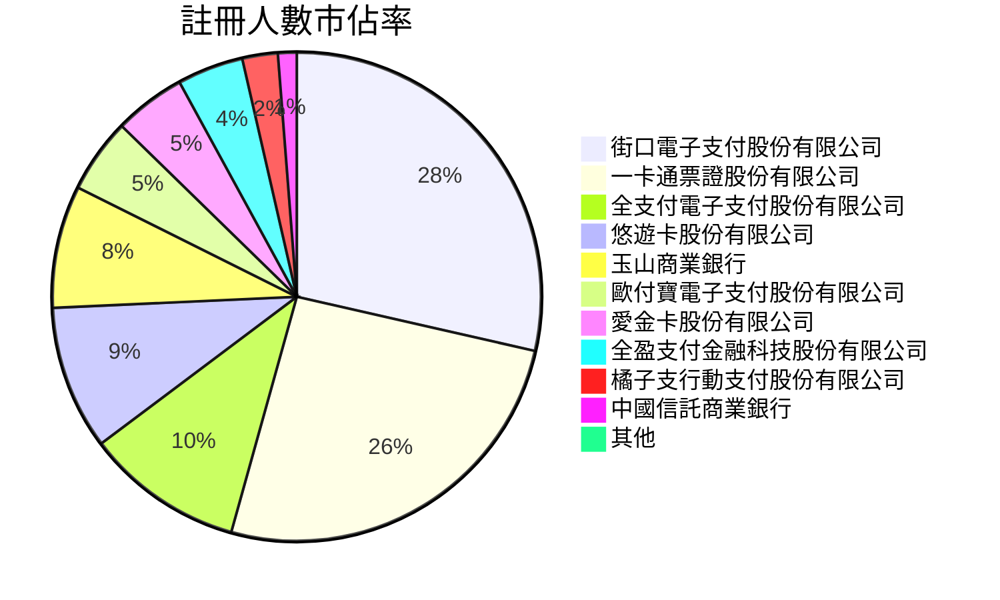
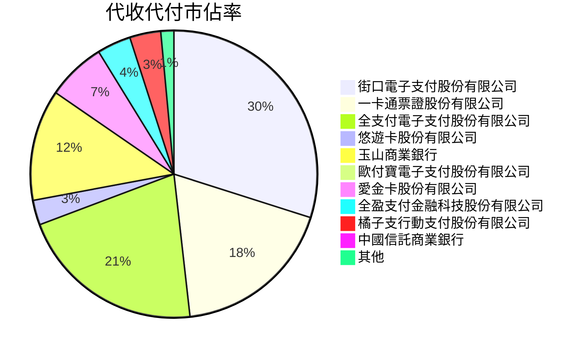
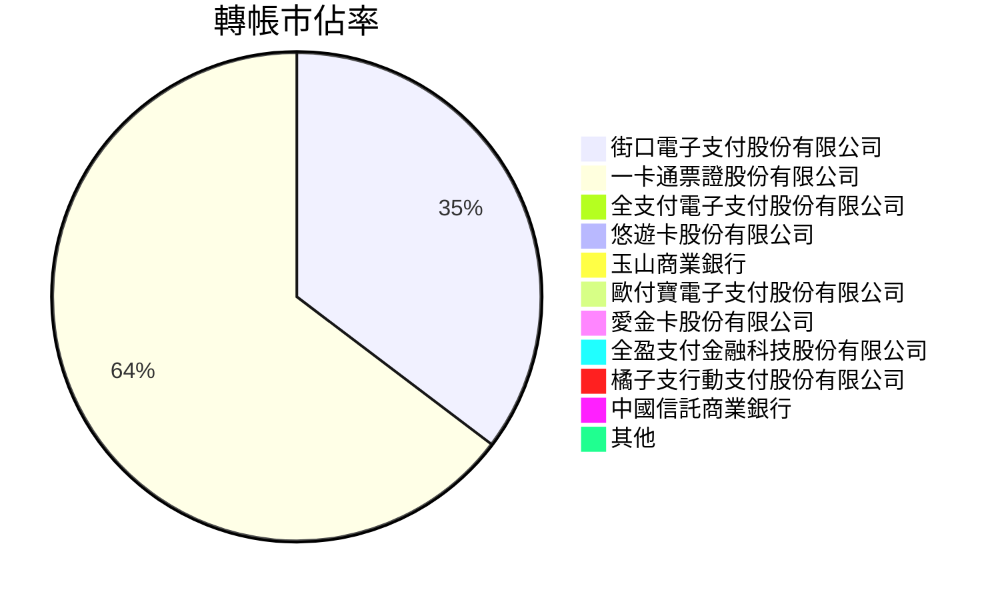
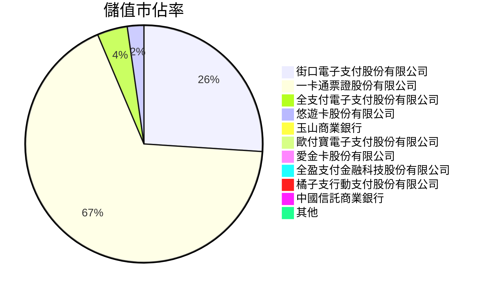
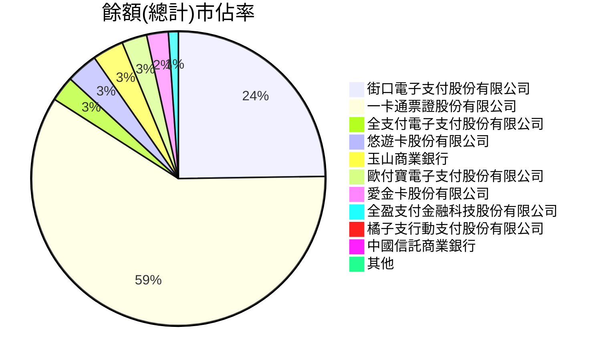
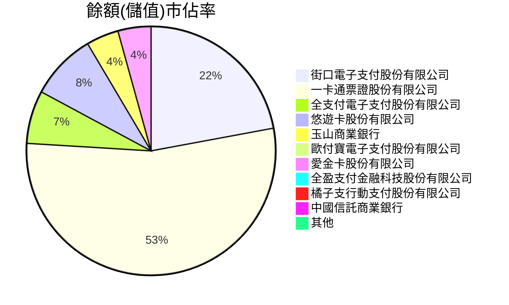
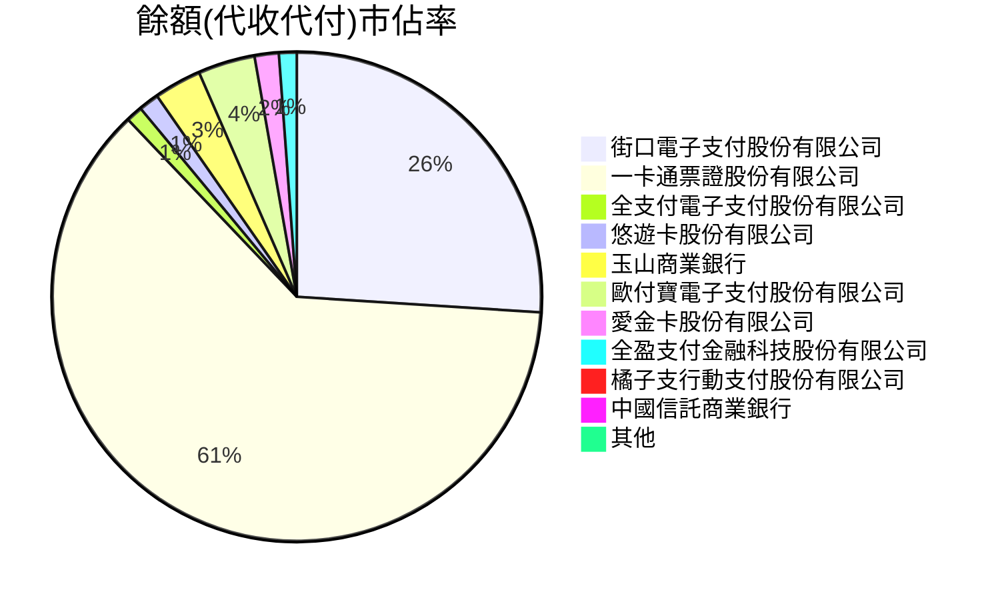

# 11110

| 機構代碼 | 機構名稱                     | 註冊人數 | 代收代付 |    轉帳 |     儲值 |    餘額 | 儲值餘額 | 代收代付餘額 | 餘額-(儲值餘額+代收代付餘額) |
| -------- | ---------------------------- | -------: | -------: | ------: | -------: | ------: | -------: | -----------: | ---------------------------: |
| 396      | 街口電子支付股份有限公司     |  5877473 |  3442897 | 4057959 |  6462743 | 2248217 |   588214 |      1660003 |                            0 |
| 391      | 一卡通票證股份有限公司       |  5302337 |  2108008 | 7431876 | 16785834 | 5383404 |  1435857 |      3947547 |                            0 |
| 389      | 全支付電子支付股份有限公司   |  2146644 |  2425528 |    6347 |  1022553 |  253343 |   183543 |        69800 |                            0 |
| 390      | 悠遊卡股份有限公司           |  1959435 |   321821 |   63143 |   560763 |  315886 |   230273 |        85612 |                            1 |
| 808      | 玉山商業銀行                 |  1665172 |  1442453 |       0 |    30383 |  312333 |   112103 |       200231 |                           -1 |
| 397      | 歐付寶電子支付股份有限公司   |  1016038 |    50470 |   10288 |     6321 |  250854 |    10560 |       240293 |                            1 |
| 392      | 愛金卡股份有限公司           |   974139 |   762421 |   57259 |   211880 |  216531 |   114401 |       102130 |                            0 |
| 388      | 全盈支付金融科技股份有限公司 |   900741 |   439363 |    1806 |    54948 |   99251 |    24395 |        74856 |                            0 |
| 395      | 橘子支行動支付股份有限公司   |   483008 |   402918 |   22725 |    50380 |   61547 |    21386 |        40160 |                            1 |
| 822      | 中國信託商業銀行             |   254919 |    19042 |       0 |      302 |   30396 |      602 |        29794 |                            0 |
| 398      | 簡單行動支付股份有限公司     |    63193 |     3322 |    1639 |      439 |    6174 |     1232 |         4942 |                            0 |
| 394      | 國際連股份有限公司           |    35290 |        0 |    1015 |      512 |    1058 |      559 |          499 |                            0 |
| 700      | 中華郵政公司                 |    25306 |    61323 |       0 |        0 |       0 |        0 |            0 |                            0 |
| 812      | 台新國際商業銀行             |    15278 |    10967 |       0 |        0 |     488 |        0 |          488 |                            0 |
| 009      | 彰化商業銀行                 |     8752 |     9538 |       0 |        0 |     443 |        0 |          443 |                            0 |
| 006      | 合作金庫商業銀行             |     8491 |    24938 |       0 |        0 |       0 |        0 |            0 |                            0 |
| 108      | 陽信商業銀行                 |     6595 |      547 |       0 |        0 |       0 |        0 |            0 |                            0 |
| 004      | 臺灣銀行                     |     5675 |    10047 |       0 |        0 |       0 |        0 |            0 |                            0 |
| 005      | 臺灣土地銀行                 |     4648 |     6957 |       0 |        0 |       0 |        0 |            0 |                            0 |
| 807      | 永豐商業銀行                 |     3814 |     5850 |       0 |        0 |     181 |        0 |          181 |                            0 |
| 050      | 臺灣中小企業銀行             |     2500 |     4032 |       0 |        0 |     147 |        0 |          147 |                            0 |
| 806      | 元大商業銀行                 |     2136 |     5909 |       0 |        0 |      60 |        0 |           60 |                            0 |
| 011      | 上海商業儲蓄銀行             |     1738 |     1413 |       0 |        0 |       0 |        0 |            0 |                            0 |
| 012      | 台北富邦商業銀行             |     1569 |      670 |       0 |        0 |     195 |        0 |          195 |                            0 |
| 007      | 第一商業銀行                 |     1504 |     2257 |       0 |        0 |     575 |        0 |          575 |                            0 |
| 008      | 華南商業銀行                 |     1058 |     1162 |       0 |        0 |     134 |        0 |          134 |                            0 |
| 017      | 兆豐國際商業銀行             |      814 |     1325 |       0 |        0 |     168 |        0 |          168 |                            0 |
| 013      | 國泰世華商業銀行             |      616 |    16184 |       0 |        0 |       0 |        0 |            0 |                            0 |
| 103      | 臺灣新光商業銀行             |      478 |     2290 |       0 |        0 |     236 |        0 |          236 |                            0 |
| 805      | 遠東國際商業銀行             |       38 |      900 |       0 |        0 |       0 |        0 |            0 |                            0 |

