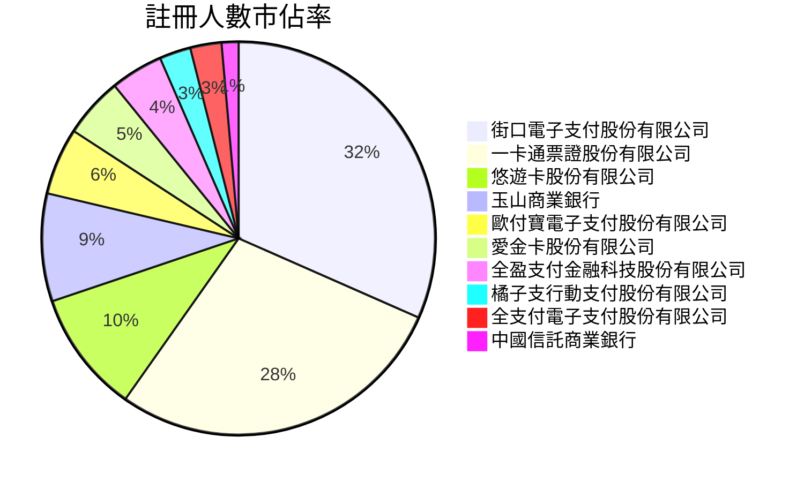
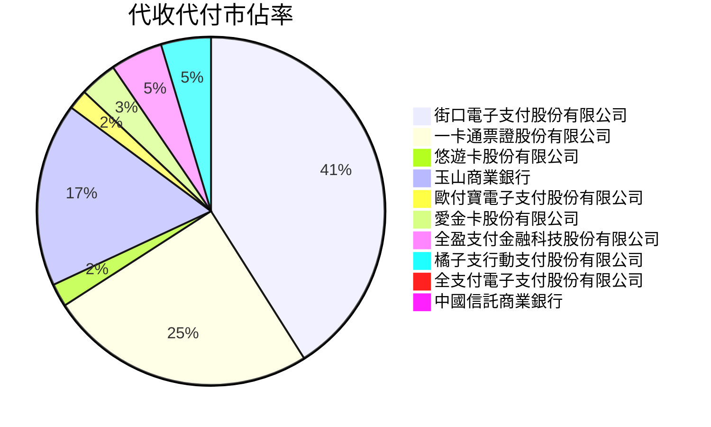
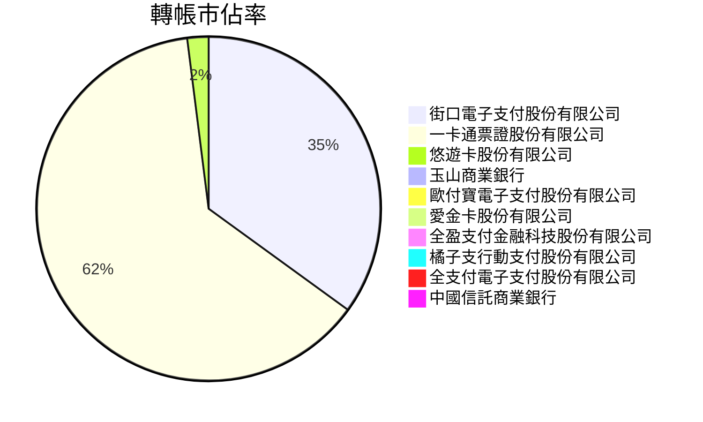
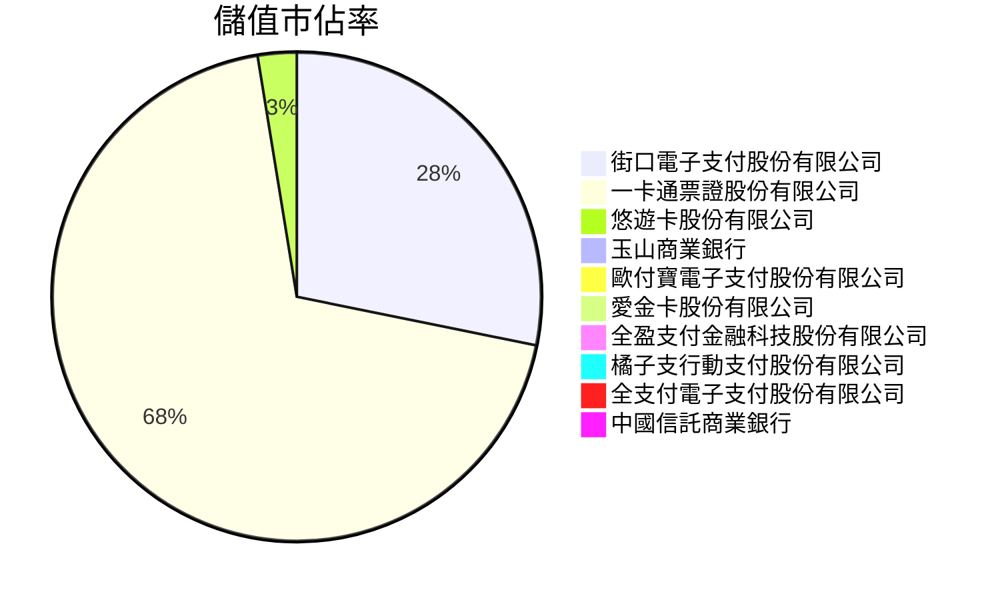
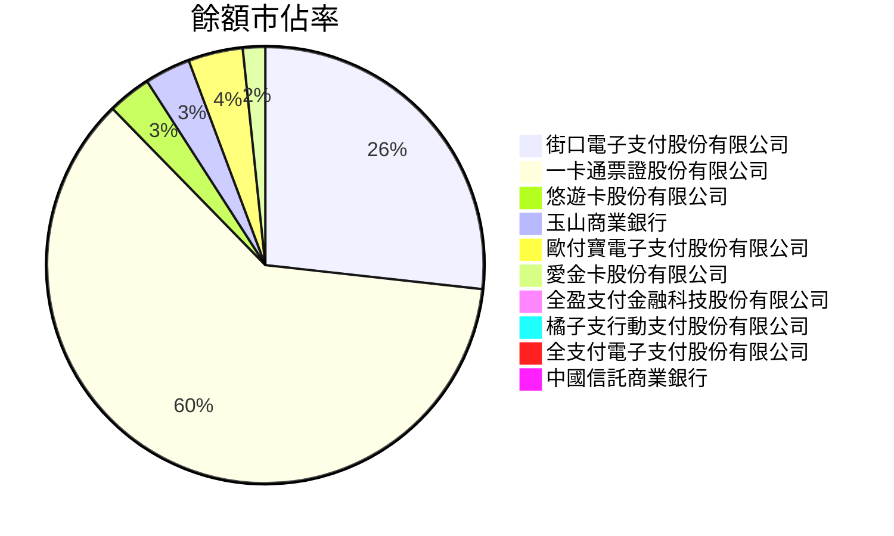

# 11108

| 機構代碼 | 機構名稱                     | 註冊人數 | 代收代付 | 轉帳    | 儲值     | 餘額    | 儲值餘額 | 代收代付餘額 | 餘額-(儲值餘額+代收代付餘額) |
| -------- | ---------------------------- | -------- | -------- | ------- | -------- | ------- | -------- | ------------ | ---------------------------- |
| 396      | 街口電子支付股份有限公司     | 5808133  | 3455470  | 3939842 | 6448229  | 2173964 | 569912   | 1604052      | 0                            |
| 391      | 一卡通票證股份有限公司       | 5176764  | 2096648  | 7094474 | 15840427 | 4951756 | 1368966  | 3582790      | 0                            |
| 390      | 悠遊卡股份有限公司           | 1848606  | 181686   | 225151  | 587888   | 261044  | 219567   | 41477        | 0                            |
| 808      | 玉山商業銀行                 | 1629808  | 1440133  | 0       | 29333    | 275828  | 102889   | 172938       | 1                            |
| 397      | 歐付寶電子支付股份有限公司   | 1011824  | 156612   | 10175   | 5002     | 328404  | 10249    | 318155       | 0                            |
| 392      | 愛金卡股份有限公司           | 910089   | 292580   | 44352   | 200924   | 134694  | 73099    | 61595        | 0                            |
| 388      | 全盈支付金融科技股份有限公司 | 794141   | 410674   | 1370    | 61041    | 55784   | 22234    | 33551        | -1                           |
| 395      | 橘子支行動支付股份有限公司   | 473731   | 391426   | 70379   | 41353    | 62855   | 20002    | 42853        | 0                            |
| 389      | 全支付電子支付股份有限公司   | 471332   | 60458    | 617     | 31651    | 21935   | 10233    | 11702        | 0                            |
| 822      | 中國信託商業銀行             | 255718   | 23711    | 0       | 0        | 31638   | 617      | 31021        | 0                            |
| 398      | 簡單行動支付股份有限公司     | 62108    | 13032    | 90674   | 1319     | 6576    | 1056     | 5519         | 1                            |
| 394      | 國際連股份有限公司           | 35242    | 0        | 42      | 68       | 977     | 550      | 427          | 0                            |
| 700      | 中華郵政公司                 | 25095    | 60629    | 0       | 0        | 0       | 0        | 0            | 0                            |
| 812      | 台新國際商業銀行             | 14789    | 10706    | 0       | 0        | 4297    | 0        | 4297         | 0                            |
| 009      | 彰化商業銀行                 | 8581     | 10927    | 0       | 0        | 577     | 0        | 577          | 0                            |
| 006      | 合作金庫商業銀行             | 8334     | 32539    | 0       | 0        | 0       | 0        | 0            | 0                            |
| 108      | 陽信商業銀行                 | 6590     | 514      | 0       | 0        | 0       | 0        | 0            | 0                            |
| 004      | 臺灣銀行                     | 5536     | 11562    | 0       | 0        | 0       | 0        | 0            | 0                            |
| 005      | 臺灣土地銀行                 | 4521     | 6343     | 0       | 0        | 0       | 0        | 0            | 0                            |
| 807      | 永豐商業銀行                 | 3632     | 5936     | 0       | 0        | 253     | 0        | 253          | 0                            |
| 050      | 臺灣中小企業銀行             | 2444     | 3639     | 0       | 0        | 387     | 0        | 387          | 0                            |
| 806      | 元大商業銀行                 | 2073     | 6727     | 0       | 0        | 576     | 0        | 576          | 0                            |
| 011      | 上海商業儲蓄銀行             | 1688     | 2458     | 0       | 0        | 0       | 0        | 0            | 0                            |
| 012      | 台北富邦商業銀行             | 1586     | 694      | 0       | 0        | 44      | 0        | 44           | 0                            |
| 007      | 第一商業銀行                 | 1503     | 1811     | 0       | 0        | 385     | 0        | 385          | 0                            |
| 008      | 華南商業銀行                 | 1060     | 1145     | 0       | 0        | 83      | 0        | 83           | 0                            |
| 017      | 兆豐國際商業銀行             | 813      | 843      | 0       | 0        | 3       | 0        | 3            | 0                            |
| 013      | 國泰世華商業銀行             | 607      | 14885    | 0       | 0        | 0       | 0        | 0            | 0                            |
| 103      | 臺灣新光商業銀行             | 478      | 1521     | 0       | 0        | 92      | 0        | 92           | 0                            |
| 805      | 遠東國際商業銀行             | 38       | 1112     | 0       | 0        | 0       | 0        | 0            | 0                            |

